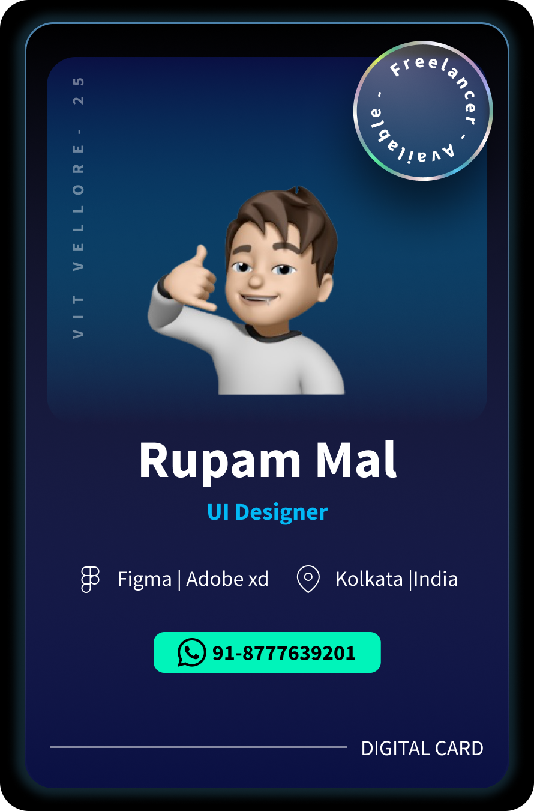
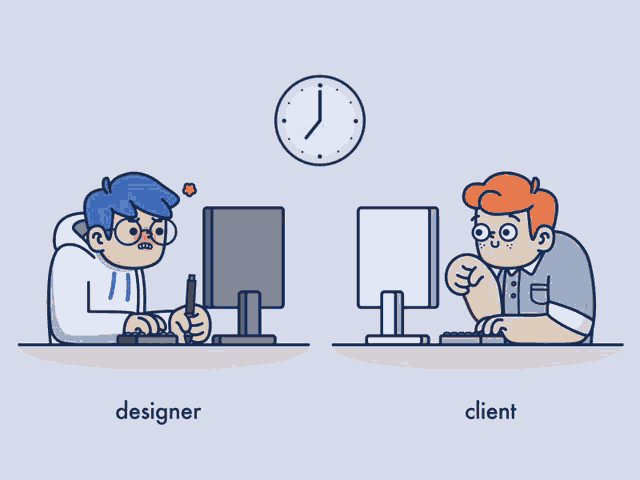

<h1 align="center">Hi 👋, I'm Rupam Mal</h1>
<h3 align="center">Electronics and communication student passionate about Web dev and UI-UX design</h3>

  

  

  

- 🔭 I’m currently working on **Movie Rating website**

- 🌱 I’m currently learning **Enterprise Designing**

- 🤝 I’m looking for help with **Competitive programming**

- 👨‍💻 All of my projects are available at [https://github.com/RupamMal](https://github.com/RupamMal)

- 📝 I regularly write articles on [https://medium.com/@rupammal25](https://medium.com/@rupammal25)

- 📫 How to reach me **rupammal25@gmail.com**

- 📄 Know about my experiences [https://rupammal.github.io/animated_portfolio/](https://rupammal.github.io/animated_portfolio/)

- ⚡ Fun fact **I am an expert for giving punch lines**

### Blogs posts
<!-- BLOG-POST-LIST:START -->
<!-- BLOG-POST-LIST:END -->

<h3 align="left">Connect with me:</h3>

<h3 align="left">Languages and Tools:</h3>

                  

 

<h2 align="center">🏆 Trophies</h2></a>

 

 

  

 

<p<<h2 align="center">Some stats</he>

&nbsp;

